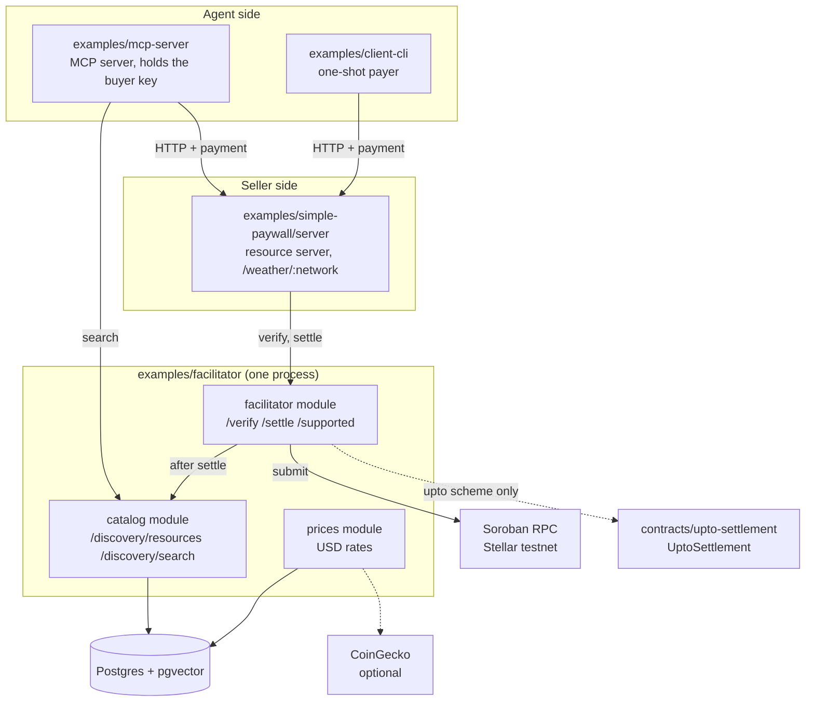
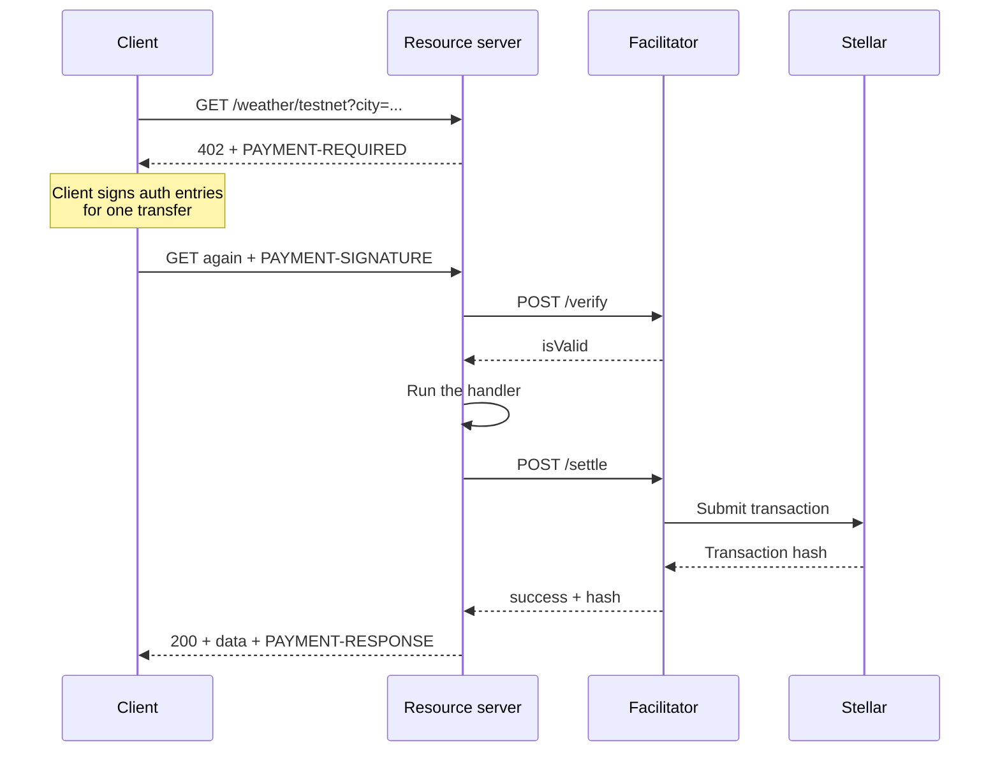
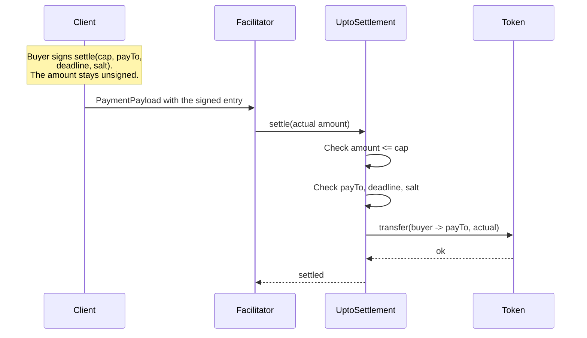
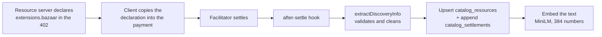
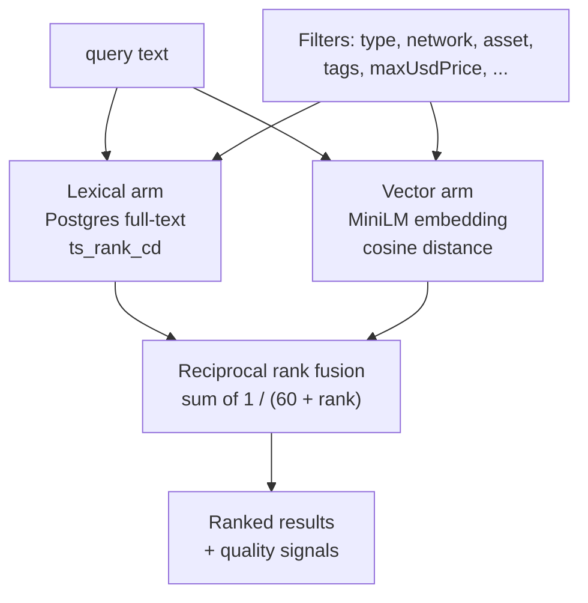
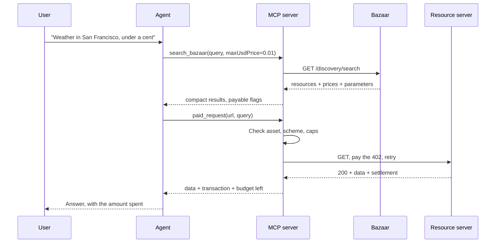

# Architecture

This repository holds an x402 facilitator for Stellar, a Bazaar catalog, a paid demo endpoint, and two clients. This document shows the components and the flows between them.

Each README holds the details of one part: its endpoints, its environment variables, and its data.

The x402 protocol is unchanged here. All protocol logic comes from the `@x402/*` packages. This code adds the service shell, the catalog, and the clients.

## Components

Each part has one job:

| Component          | Job                                                                    |
| ------------------ | ---------------------------------------------------------------------- |
| facilitator module | Validates a payment. Submits it to the network. Answers `/supported`.  |
| catalog module     | Records paid resources. Serves list and search.                        |
| prices module      | Keeps USD rates for the price filter.                                  |
| resource server    | Sells one endpoint. Returns `402` until the client pays.               |
| MCP server         | Gives an agent two tools: search the Bazaar, and call a paid endpoint. |
| client-cli         | Pays one endpoint from the command line.                               |
| UptoSettlement     | Enforces the cap of an `upto` payment on-chain.                        |
| packages/shared    | Shared helpers for x402 headers.                                       |
| packages/paywall   | Browser paywall UI for the demo client.                                |

Default ports: facilitator `4022`, resource server `3001`, Postgres `5442`.

## Flow 1: an exact payment

This is the default x402 flow. The buyer signs one transfer of a known amount.

Three rules hold in this flow:

- The facilitator never holds the buyer key. It receives a signed authorization only.
- The facilitator rebuilds the transaction with itself as the source. It pays the fee.
- `/settle` verifies again. It never trusts an earlier `/verify`.

## Flow 2: an upto payment

The `upto` scheme lets the seller charge less than a signed ceiling. Stellar auth entries authorize an exact transfer, so a contract must hold the ceiling. The facilitator serves this scheme only when `UPTO_CONTRACT_ID` is set.

The contract checks four things: the amount is not above the cap, the recipient matches, the deadline is not passed, and the salt is unused. The buyer signs one time for both steps.

## Flow 3: how a resource enters the catalog

There is no registration step. The catalog learns from settlements only.

Points to know:

- The client copy is automatic. `@x402/core` merges `paymentRequired.extensions` into the payload.
- Validation is `@x402/extensions/bazaar`, not our own code. It checks the route template, cleans the service metadata, and validates `info` against its schema.
- A row is identified by `(resource, tool_name)`. Two MCP tools on one endpoint keep two rows.
- `accepts` holds the payment options seen in settlements. It is not the full set the seller declares.
- The hook never fails a settlement. A catalog error is logged only.

## Flow 4: hybrid search

`GET /discovery/search` ranks the catalog with two methods and joins the results.

Design points:

- Both arms apply every filter. A filter is a hard limit, not a later trim.
- The two scores are not comparable, so only the ranks are used.
- A `FULL OUTER JOIN` keeps a row that one arm alone found.
- The lexical query ORs its terms. AND would match almost nothing.
- The model runs in the process. No API key and no network call.
- Ranking ignores usage. The `quality` numbers are shown, not scored.

## Flow 5: an agent discovers and pays

The MCP server gives an agent two free tools. It knows one URL: the facilitator.

The agent learns the parameter names from `extensions.bazaar.info.input` in the search result. Nothing is set up in advance.

Guards inside `paid_request`:

- An asset allowlist. Only listed assets can be signed for.
- Only the `exact` scheme. An `upto` price is refused.
- A per-call cap and a session budget.
- The budget is charged when the payment is signed. A lost answer can still be a spent payment.
- Payment headers from the caller are refused.

Every refusal returns a code from a closed set and a reason that is never empty.
